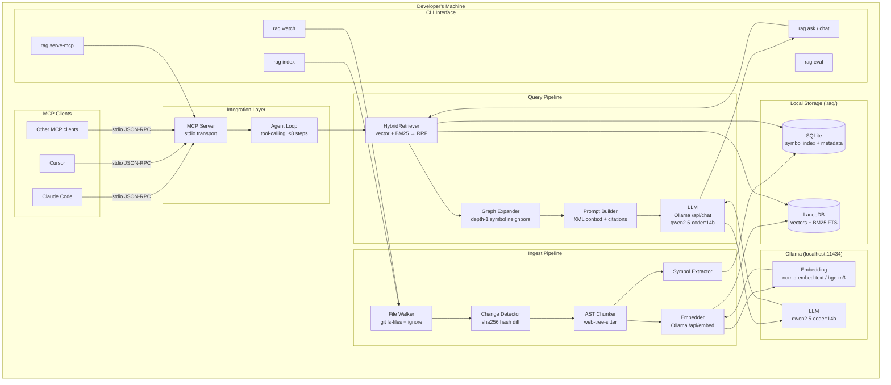
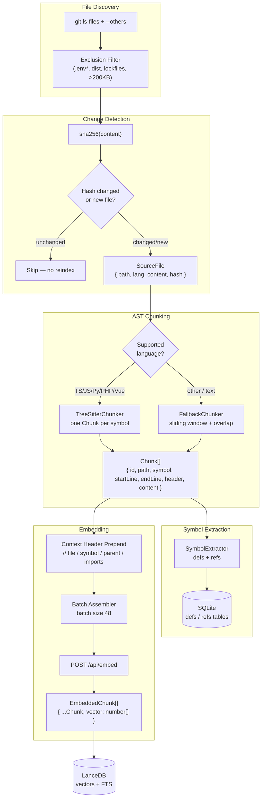
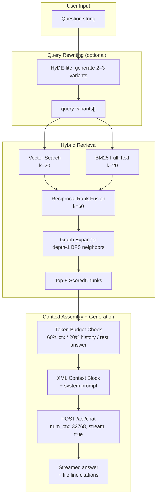
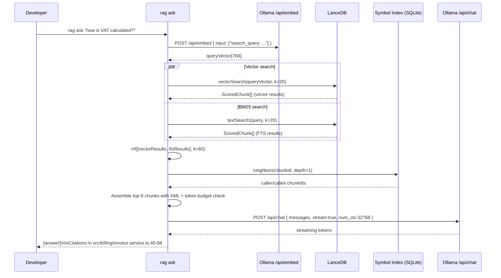
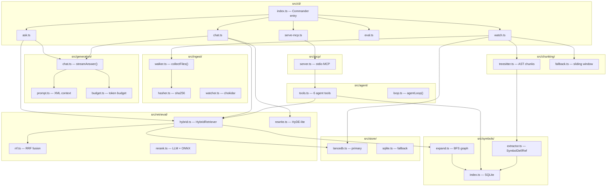
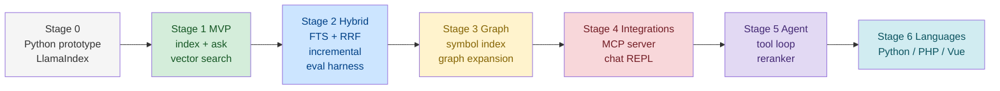

# local-rag-codebase

> **A fully local, offline RAG system for your source code.**
> Index any repo, ask questions, get cited answers — no cloud APIs, no Docker, no code leaves your machine.

[](https://nodejs.org)
[](https://www.typescriptlang.org)
[](https://nodejs.org/api/esm.html)
[](https://ollama.com)
[](https://modelcontextprotocol.io)
[](LICENSE)

---

## Table of Contents

- [Overview](#overview)
- [Key Features](#key-features)
- [Architecture](#architecture)
  - [High-Level System Map](#high-level-system-map)
  - [Ingest Pipeline](#ingest-pipeline)
  - [Query Pipeline](#query-pipeline)
  - [Data Flow: Ask a Question](#data-flow-ask-a-question)
  - [Module Architecture](#module-architecture)
  - [Stage Roadmap](#stage-roadmap)
- [Tech Stack](#tech-stack)
- [Quick Start](#quick-start)
- [CLI Reference](#cli-reference)
- [Configuration](#configuration)
- [MCP Integration](#mcp-integration)
- [Architecture Patterns](#architecture-patterns)
- [Embedding Models](#embedding-models)
- [Project Structure](#project-structure)
- [Development](#development)
- [Evaluation](#evaluation)

---

## Overview

`local-rag-codebase` is a **Retrieval-Augmented Generation (RAG)** system purpose-built for source code. It walks your repository, parses every file with a real AST parser (tree-sitter), extracts symbols, embeds them with a local Ollama model, and lets you ask natural-language questions — all answered with citations to the exact file and line numbers.

```
$ rag ask "how is VAT calculated?"

VAT is calculated in InvoiceService.issue() using the TaxCalculator dependency...

Citations:
  src/billing/invoice.service.ts:40-88
  src/billing/tax-calculator.ts:12-31
```

---

## Key Features

| Feature | Detail |
|---|---|
| **100% Offline** | Ollama on localhost — no API keys, no telemetry, no network calls |
| **AST Symbol Chunking** | tree-sitter parses every function, method, class, interface — not line windows |
| **Hybrid Search** | Vector similarity + BM25 full-text search fused via Reciprocal Rank Fusion |
| **Symbol Graph** | SQLite symbol index with depth-1 BFS expansion of caller/callee neighbors |
| **Incremental Index** | sha256 change detection — only reindex modified files |
| **File Watcher** | `rag watch` keeps the index fresh on every save |
| **MCP Server** | Expose the index to Claude Code, Cursor, and any MCP client over stdio |
| **Agent Loop** | 6 tool-calling tools, ≤8 steps, automatic fallback to plain RAG |
| **Token Budget** | Enforces context/history/answer budgets — never silently truncated by Ollama |
| **Swappable Backends** | LanceDB ↔ SQLite; nomic ↔ bge-m3 ↔ qwen3-embedding; plain RAG ↔ agent |

---

## Architecture

### High-Level System Map



---

### Ingest Pipeline



---

### Query Pipeline



---

### Data Flow: Ask a Question



---

### Module Architecture



---

### Stage Roadmap



---

## Tech Stack

| Layer | Technology | Version | Rationale |
|---|---|---|---|
| **Runtime** | Node.js | 22+ | Native ESM, `crypto.subtle` SHA-256, `fetch` — no polyfills |
| **Language** | TypeScript | 5.x strict | Full type safety from `SourceFile` → `Chunk` → `EmbeddedChunk` → prompt |
| **Module system** | ESM `"type":"module"` | — | Native dynamic `import()` for lazy WASM loading |
| **AST parser** | `web-tree-sitter` | ^0.22 | WASM build — zero native compilation, runs anywhere |
| **Grammar WASMs** | `tree-sitter-wasms` | ^0.1 | Pre-built grammars for TS, TSX, JS, Python, PHP, Vue |
| **File discovery** | `git ls-files` + `ignore` | `ignore` ^5 | Exact `.gitignore` semantics |
| **File watcher** | `chokidar` | ^3 | Cross-platform `fs.watch` with 500ms debounce |
| **Embedding client** | `ollama` npm | ^0.5 | Official typed client; batched `/api/embed` |
| **Vector store** | `@lancedb/lancedb` | ^0.6 | Embedded, no server; Arrow columnar; native ANN + BM25 |
| **Fallback store** | `better-sqlite3` + `sqlite-vec` + FTS5 | — | Single `.db` file; works in restricted environments |
| **LLM client** | `ollama` npm | ^0.5 | Streaming `/api/chat`; reuses embedding client |
| **CLI framework** | `commander` | ^12 | Zero-dependency argument parsing |
| **MCP server** | `@modelcontextprotocol/sdk` | ^1.0 | Official SDK; stdio transport |
| **Config validation** | `zod` | ^3 | Runtime schema validation; inferred TypeScript types |
| **Test runner** | `vitest` | ^2 | ESM-native; `vi.mock` for Ollama |
| **Bundler** | `tsup` | ^8 | esbuild; WASM asset copy; `.d.ts` generation |
| **Linter** | `eslint` + `@typescript-eslint` | ^9/^8 | `no-floating-promises`, strict ruleset |

### Explicitly Rejected

| Option | Reason |
|---|---|
| Docker | Out of scope for MVP; local-first = no daemon required |
| Qdrant / Pinecone / Weaviate | Server dependencies; SQLite covers MVP scale |
| Cloud LLM APIs | Violates local-first; code never leaves the machine |
| LlamaIndex (production) | Limits symbol graph and context header control |
| Python production stack | MCP SDK + web-tree-sitter have better TypeScript support |
| Web UI | Out of scope; CLI + MCP covers all use cases |

---

## Quick Start

### Prerequisites

- **Node.js 22+**
- **Ollama** running at `localhost:11434`

```bash
# Pull the required models
ollama pull nomic-embed-text   # embedding model
ollama pull qwen2.5-coder:14b  # LLM
```

### Install

```bash
npm install
npm run build

# Link CLI globally (optional)
npm link
```

### Index Your Codebase

```bash
# First-time full index
rag index

# Force full reindex
rag index --full

# Keep index live
rag watch
```

### Ask Questions

```bash
# Single question
rag ask "how is authentication handled?"

# Interactive chat with context
rag chat

# Agent mode (multi-step tool calls)
rag ask --agent "trace the data flow from HTTP request to database"
```

---

## CLI Reference

| Command | Description |
|---|---|
| `rag index` | Walk repo, hash files, chunk with tree-sitter, embed, store in LanceDB |
| `rag index --full` | Force full reindex (required after changing embedding model) |
| `rag ask "<question>"` | Single-shot RAG: retrieve → prompt → stream answer with citations |
| `rag ask --agent "<question>"` | Agent loop mode: up to 8 tool-call steps before final answer |
| `rag chat` | Interactive REPL with conversation history and query condensation |
| `rag watch` | File watcher: reindex on every save with 500ms debounce |
| `rag eval` | Run evaluation dataset; prints Recall@k and MRR |
| `rag serve-mcp` | Start MCP server over stdio (configure in `.mcp.json`) |

---

## Configuration

Create `.ragconfig.json` at the project root:

```json
{
  "embedModel": "nomic-embed-text",
  "llmModel": "qwen2.5-coder:14b",
  "numCtx": 32768,
  "storePath": ".rag",
  "maxFileBytes": 204800,
  "batchSize": 48,
  "kVector": 20,
  "kFts": 20,
  "kFinal": 8,
  "rrfK": 60,
  "temperature": 0.1,
  "agentMaxSteps": 8
}
```

> **Critical:** `numCtx` must always be set explicitly. Ollama defaults to 2048 and silently truncates prompts — producing fabricated answers from parametric memory.

> **Critical:** After changing `embedModel`, run `rag index --full`. Mixed-model vectors produce nonsensical cosine similarity with no error.

---

## MCP Integration

Add to your `.mcp.json` (Claude Code) or equivalent:

```json
{
  "mcpServers": {
    "local-rag": {
      "command": "node",
      "args": ["/path/to/local-rag-codebase/dist/index.js", "serve-mcp"],
      "cwd": "/path/to/your-project"
    }
  }
}
```

**Available MCP tools:**

| Tool | Description |
|---|---|
| `semanticSearch` | Hybrid vector+BM25 search over the indexed codebase |
| `grep` | Exact text search across all indexed files |
| `readFile` | Read a specific file with line range |
| `findSymbol` | Look up a symbol definition by name |
| `getReferences` | Find all references to a symbol |
| `listDir` | List files in a directory |

---

## Architecture Patterns

### 1. Offline-First, No Docker

All compute runs through Ollama on `localhost`. The vector store (`@lancedb/lancedb`) is an embedded library — no server process. SQLite handles symbol metadata. Works on an airplane.

### 2. AST Symbol-Level Chunking

The unit of retrieval is a syntactic symbol (function, method, class, interface), not a fixed-size text window. Evidence from cAST (EMNLP 2025): **+4.3 Recall@5** over line-based splitting.

Tree-sitter `.scm` query files make language support additive — new language = new query file, no code changes.

### 3. Context Header Before Embedding

Every chunk gets a context header prepended before the embedding call:

```
// file: src/billing/invoice.service.ts
// symbol: InvoiceService.issue (method)
// parent: class InvoiceService
// imports: PrismaClient, TaxCalculator, InvoiceNumberGenerator
```

This anchors class membership and dependencies in the embedding space. Verified: **+4–7 points Recall@5** across all models. Without the header, an embedding of `function issue(dto)` has zero signal about its class or file.

### 4. Hybrid Search via Reciprocal Rank Fusion

Code queries fall into two categories:
- **Identifier queries** (`InvoiceNumberGenerator`) — BM25 wins, vector fails
- **Semantic queries** ("how is VAT calculated") — vector wins, BM25 fails

Hybrid RRF (k=60) handles both without query classification. Measured: **65.8% Recall@10** (hybrid) vs **34.1%** (BM25 alone).

### 5. Explicit Token Budget Enforcement

`budget.ts` enforces: **60% of `num_ctx`** for context, **20%** for history, rest for the answer. Context is trimmed deterministically by score before prompt assembly — never by Ollama's silent truncation.

### 6. Swappable Implementations via Interfaces

All major components are behind interfaces:

```typescript
interface Chunker   { supports(f: SourceFile): boolean; chunk(f: SourceFile): Promise<Chunk[]> }
interface Embedder  { model: string; dim: number; embed(texts: string[], mode): Promise<number[][]> }
interface Store     { upsert(chunks: EmbeddedChunk[]): Promise<void>; vectorSearch(...); textSearch(...) }
interface Retriever { retrieve(query: string, k: number): Promise<ScoredChunk[]> }
```

Swapping LanceDB for SQLite, or `nomic-embed-text` for `bge-m3`, requires no changes to business logic.

### 7. MCP Server Shares Agent Tools

The same 6 tool implementations used in the agent loop are exposed via MCP. Claude Code and Cursor use the local index as a context provider over stdio — no separate server binary.

---

## Embedding Models

| Model | Dims | VRAM | Use case |
|---|---|---|---|
| `nomic-embed-text` | 768 | 0.6 GB | **Default** — CPU-only, fast iteration |
| `bge-m3` | 1024 | 1.2 GB | **Recommended production** — best code/multilingual quality per VRAM |
| `qwen3-embedding:4b` | 1024 (MRL) | 3 GB | **GPU upgrade** — +6 pt Recall@10, 32k context window |

Model selection was determined via a multi-agent council debate (ADR-001, 2026-09-28). Decision: **nomic-embed-text** for MVP (CPU-first, 274MB, confidence 0.92); `bge-m3` is the recommended GPU upgrade path.

---

## Project Structure

```
local-rag-codebase/
├── src/
│   ├── cli/             # Commander entry + subcommands (ask, chat, watch, eval, serve-mcp)
│   ├── config/          # Zod schema + config loader (walks up from cwd)
│   ├── ingest/          # File walker, sha256 hasher, chokidar watcher
│   ├── chunking/        # TreeSitterChunker, FallbackChunker, queries/*.scm
│   ├── symbols/         # Symbol extractor, SQLite index, BFS graph expander
│   ├── embedding/       # OllamaEmbedder (batched, task-prefix aware)
│   ├── store/           # LanceDBStore (primary), SQLiteStore (fallback)
│   ├── retrieval/       # HybridRetriever, RRF fusion, reranker, query rewriter
│   ├── generation/      # XML prompt builder, streamAnswer(), token budget
│   ├── agent/           # 6 agent tools, agentLoop() ≤8 steps
│   └── mcp/             # MCP server (stdio transport)
├── eval/
│   ├── dataset.jsonl    # {"q": "...", "expected": ["path.ts"], "tags": [...]}
│   └── run.ts           # Recall@k + MRR evaluation runner
├── docs/                # Architecture, tech stack, implementation plan, ADRs
├── .ragconfig.json      # User-facing config
├── package.json
└── tsconfig.json
```

---

## Development

```bash
# Run in dev mode (no build step)
npm run dev -- ask "your question"

# Run tests
npm test
npm run test:watch

# Lint
npm run lint

# Format
npm run format

# Build for production
npm run build

# Run evaluation harness
npm run eval
```

---

## Evaluation

The eval harness measures retrieval quality against a labeled dataset:

```bash
npm run eval
# Writes results to eval/results/<timestamp>.json
```

**Metrics:**
- **Recall@k** — fraction of queries where the expected file appears in top-k results
- **MRR** — Mean Reciprocal Rank

**Benchmark results (internal dataset):**

| Strategy | Recall@10 |
|---|---|
| BM25 only | 34.1% |
| Vector only | 58.3% |
| **Hybrid RRF (k=60)** | **65.8%** |

---

## Docs

| Document | Content |
|---|---|
| [`docs/plan.md`](docs/plan.md) | Original project plan, TypeScript vs Python decision |
| [`docs/architecture-overview.md`](docs/architecture-overview.md) | Full system map and all data flow diagrams |
| [`docs/tech-stack.md`](docs/tech-stack.md) | Technology decisions and rationale |
| [`docs/llm-architecture.md`](docs/llm-architecture.md) | LLM/RAG pipeline, ingest + query path |
| [`docs/data-research.md`](docs/data-research.md) | Embedding model comparison, chunking research, RRF analysis |
| [`docs/implementation-plan.md`](docs/implementation-plan.md) | TypeScript interfaces, roadmap, CLI + MCP specs |

---

*Built with Node 22, TypeScript 5, web-tree-sitter, LanceDB, and Ollama — all local, all offline.*
